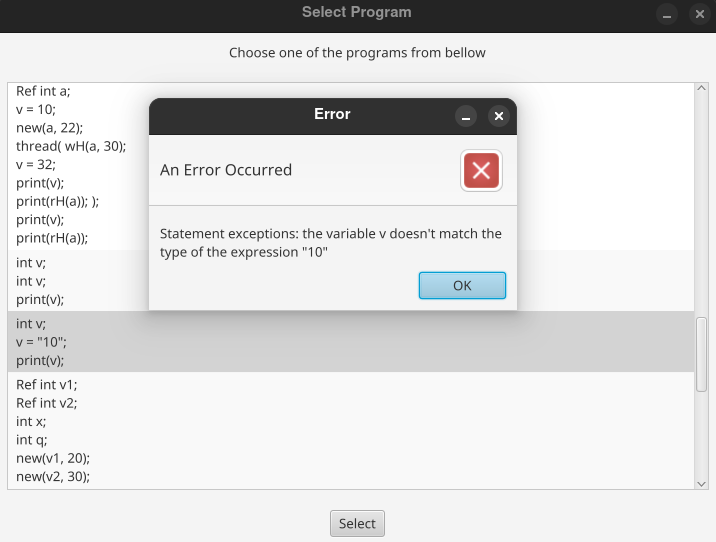
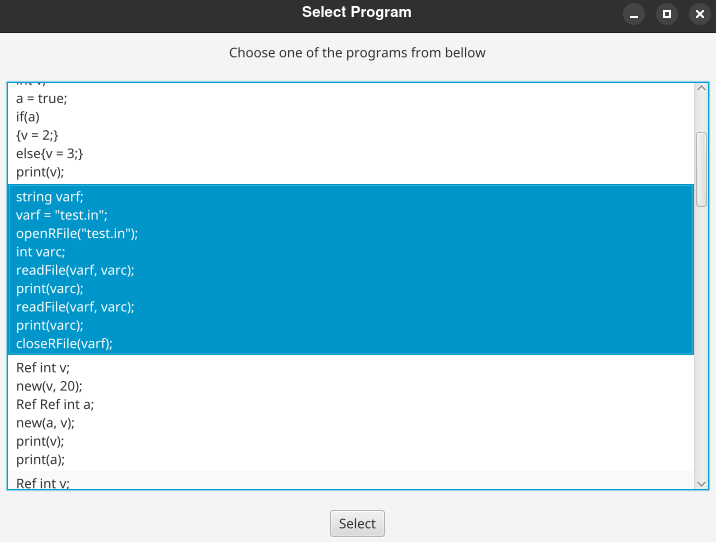
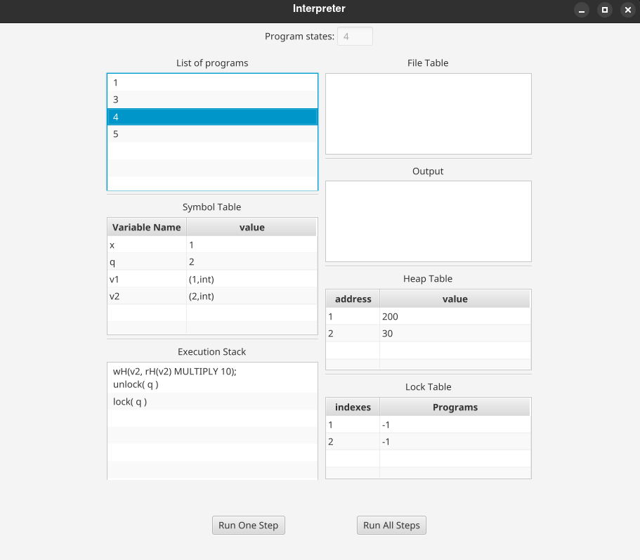

# Custom Java Interpreter

## Overview

This project is a custom interpreter implemented in Java that can parse and execute various statements and expressions. It includes features such as concurrency, garbage collection, file handling, and a lock mechanism.

## Features

- Custom Statements: The interpreter supports multiple control flow, file handling, and memory management statements.

- Expressions: Various expressions are implemented for computations and memory access.

- Logging: Execution logs are saved to a file.

- Garbage Collection: Unused memory addresses are automatically cleared.

- Concurrency & Locks: Supports multi-threading with a lock mechanism.

- GUI: Provides an interactive JavaFX-based graphical user interface.

## Statements

The interpreter supports the following statements:

- AssignStatement: Assigns a value to a variable.

- CloseRFileStatement: Closes an open file.

- CompStatement: Executes two statements sequentially.

- HeapAllocStatement: Allocates memory on the heap.

- HeapWritingStatement: Modifies a heap-allocated value.

- IfStatement: Executes a branch based on a condition.

- LockStatement: Acquires a lock for synchronization.

- NewLockStatement: Creates a new lock.

- OpenRFileStatement: Opens a file for reading.

- PrintStatement: Outputs a value.

- ReadFileStatement: Reads a value from a file.

- ThreadCreationStatement: Creates a new thread.

- UnlockStatement: Releases a previously acquired lock.

- VarDeclStatement: Declares a new variable.

- WhileStatement: Implements a loop.

## Expressions

The interpreter supports the following expressions:

- ArithmeticalExpression: Returns an IntValue representing the result of an arithmetic operation.
- HeapReadingExpression: Returns an IValue read from the heap.
- RelationalExpression: Returns a BoolValue representing the result of a relational operation.
- ValueExpression: Returns a direct IValue.
- VariableExpression: Returns an IValue from the symbol table (SymTable).

##Data Types

The interpreter supports the following value types:

- BoolValue - Represents a boolean (true or false).
- IntValue - Represents an integer.
- RefValue - Represents a reference to a heap-allocated value. It stores an address pointing to an IntValue, BoolValue, StringValue, or another RefValue.
- StringValue - Represents a string.

## Execution Logging

The interpreter logs program execution to a file. Each program state is written to the file specified in the repository setup.

## Garbage Collection

A garbage collector is implemented to automatically remove unused heap addresses. The process involves:

1. Identifying all active addresses used by the symbol table.

2. Detecting references that are no longer needed.

3. Removing unreferenced addresses from the heap.

This ensures efficient memory management during execution.

## Type Checking

- The interpreter performs static type checking to detect type mismatches before execution.

- Each statement and expression implements a typeCheck method that verifies its expected types against a type environment.

This mechanism enhances reliability by ensuring that operations are performed on compatible types before execution begins.

## Concurrency & Lock Mechanism

The interpreter supports multi-threading using Java's ExecutorService. The execution model includes:

* ThreadCreationStatement creates a new thread that executes independently, allowing concurrent execution of different program branches.

* Locking Mechanism:

    * NewLockStatement creates a new lock.

    * LockStatement acquires a lock to prevent race conditions.

    * UnlockStatement releases the lock.

This ensures thread-safe execution when accessing shared resources.

## GUI Implementation

The project includes a JavaFX-based GUI for managing and visualizing execution. The interface contains:

- Displays program states

- Shows symbol table, execution stack, heap, file table, output, and locks

- Allows execution control (step-by-step or full execution)

